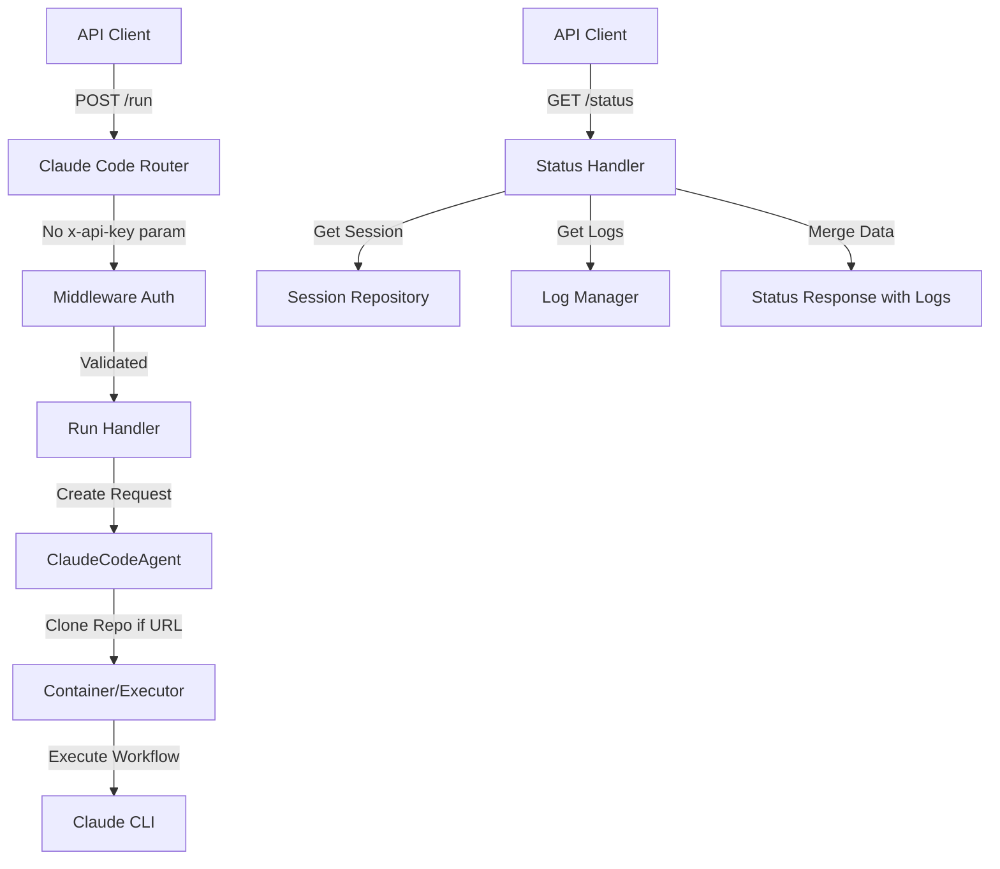

# Claude Code API Cleanup Architecture

## Overview

This document outlines the architectural design for simplifying and improving the Claude Code API. The key goals are to:

1. Add repository configuration support
2. Remove redundant x-api-key parameters from endpoints
3. Simplify the API surface to essential endpoints only
4. Auto-stream logs in the status endpoint

## Current State Analysis

### Existing API Structure
- **Base Path**: `/api/v1/agent/claude-code`
- **Authentication**: Dual layer - middleware + per-endpoint x-api-key parameter (redundant)
- **Endpoints**:
  - `POST /{workflow_name}/run` - Start workflow execution
  - `GET /run/{run_id}/status` - Get run status
  - `GET /run/{run_id}/logs` - Get run logs (separate endpoint)
  - `GET /run/{run_id}/logs/summary` - Get log summary
  - `GET /workflows` - List available workflows
  - `GET /health` - Health check
  - `GET /logs` - List all log files

### Current Issues
1. **Redundant Authentication**: The `x-api-key` is validated both in middleware (`APIKeyMiddleware`) and as a parameter in each endpoint via `Depends(verify_api_key)`
2. **Fragmented Log Access**: Logs are split across multiple endpoints instead of being included in status
3. **No Repository Configuration**: Workflows always run in the current repository with no option to specify a different one
4. **Complex API Surface**: Too many endpoints for a simple workflow execution pattern

## Proposed Architecture

### Simplified API Structure
- **Base Path**: `/api/v1/agent/claude-code` (unchanged)
- **Authentication**: Middleware only (remove per-endpoint parameters)
- **Endpoints** (reduced to 4):
  - `POST /run` - Start workflow execution with repository config
  - `GET /run/{run_id}/status` - Get status with integrated logs
  - `GET /workflows` - List available workflows
  - `GET /health` - Health check

### Key Changes

#### 1. Repository Configuration

Add `repository_url` parameter to the run request:

```python
class ClaudeCodeRunRequest(BaseModel):
    """Request for Claude-Code agent execution."""
    message: str = Field(..., description="Task description for Claude to execute")
    workflow_name: str = Field(..., description="Workflow to execute (e.g., 'architect', 'implement')")
    repository_url: Optional[str] = Field(None, description="Git repository URL to clone and work on")
    session_id: Optional[str] = Field(None, description="Optional session ID for continuation")
    max_turns: int = Field(default=30, ge=1, le=100, description="Maximum number of turns")
    git_branch: str = Field(default="main", description="Git branch to work on")
    timeout: Optional[int] = Field(default=7200, ge=60, le=14400, description="Execution timeout in seconds")
    user_id: Optional[str] = Field(None, description="User ID for the request")
    session_name: Optional[str] = Field(None, description="Optional session name")
```

When `repository_url` is provided:
- Clone the repository into the container workspace
- Set up the working directory
- Configure git credentials if available
- Default to current repository if not specified

#### 2. Remove Redundant Authentication

Current code has double authentication:
```python
# In middleware.py
class APIKeyMiddleware(BaseHTTPMiddleware):
    # Validates x-api-key header

# In routes
async def endpoint(api_key: str = Depends(verify_api_key)):
    # Redundant validation
```

Change to:
```python
# Remove all Depends(verify_api_key) parameters
async def endpoint():
    # Middleware already validated
```

#### 3. Integrate Logs into Status

Merge log functionality into the status endpoint:

```python
class ClaudeCodeStatusResponse(BaseModel):
    """Response for Claude-Code run status."""
    run_id: str
    status: str  # pending, running, completed, failed
    session_id: str
    workflow_name: str
    started_at: datetime
    updated_at: Optional[datetime]
    
    # Execution details
    container_id: Optional[str]
    execution_time: Optional[float]
    repository_url: Optional[str]  # New field
    git_branch: str
    
    # Results (when completed/failed)
    result: Optional[str]
    exit_code: Optional[int]
    git_commits: List[str]
    error: Optional[str]
    
    # Integrated logs (auto-included)
    logs: List[LogEntry]  # Last 1000 log entries
    log_summary: Dict[str, Any]  # Size, line count, timestamps
```

#### 4. Simplified Endpoint Structure

```python
# Single run endpoint without workflow in path
@claude_code_router.post("/run", response_model=ClaudeCodeRunResponse)
async def run_claude_code():
    """Start a Claude-Code workflow execution."""
    
# Status with integrated logs
@claude_code_router.get("/run/{run_id}/status", response_model=ClaudeCodeStatusResponse)
async def get_claude_code_run_status():
    """Get run status with logs included."""
    
# List workflows
@claude_code_router.get("/workflows", response_model=List[WorkflowInfo])
async def list_claude_code_workflows():
    """List available workflows."""
    
# Health check
@claude_code_router.get("/health")
async def claude_code_health():
    """Check Claude-Code agent health."""
```

### Implementation Approach

#### Phase 1: Add Repository Support (Non-Breaking)
1. Add `repository_url` field to `ClaudeCodeRunRequest`
2. Update `ClaudeCodeAgent.run()` to handle repository cloning
3. Modify container setup to clone repository when URL provided
4. Test with various repository URLs

#### Phase 2: Simplify Authentication (Breaking Change)
1. Remove `api_key: str = Depends(verify_api_key)` from all endpoints
2. Update tests to not pass x-api-key in endpoint calls
3. Document that authentication is via header only

#### Phase 3: Consolidate Endpoints (Breaking Change)
1. Move workflow_name from URL path to request body
2. Integrate log retrieval into status endpoint
3. Remove separate log endpoints
4. Update response models

#### Phase 4: Update Documentation and Tests
1. Update API documentation
2. Modify test scripts
3. Create migration guide for API consumers

### Breaking Changes Summary

1. **Authentication**: Remove x-api-key parameter from all endpoints (use header only)
2. **Run Endpoint**: Change from `POST /{workflow_name}/run` to `POST /run` with workflow_name in body
3. **Log Endpoints**: Remove `/run/{run_id}/logs` and `/run/{run_id}/logs/summary` - logs now in status
4. **Status Response**: Expanded to include logs automatically

### Migration Guide

#### Before (Current API)
```bash
# Start workflow
POST /api/v1/agent/claude-code/architect/run?x-api-key=xxx
{
    "message": "Design the system",
    "git_branch": "feature/new-design"
}

# Get status
GET /api/v1/agent/claude-code/run/{run_id}/status?x-api-key=xxx

# Get logs separately
GET /api/v1/agent/claude-code/run/{run_id}/logs?x-api-key=xxx
```

#### After (New API)
```bash
# Start workflow
POST /api/v1/agent/claude-code/run
Headers: x-api-key: xxx
{
    "message": "Design the system",
    "workflow_name": "architect",
    "repository_url": "https://github.com/example/repo.git",
    "git_branch": "feature/new-design"
}

# Get status with logs
GET /api/v1/agent/claude-code/run/{run_id}/status
Headers: x-api-key: xxx
# Response includes logs automatically
```

### Component Interactions



### Error Handling

1. **Invalid Repository URL**: Return 400 with clear error message
2. **Clone Failures**: Return 500 with git error details
3. **Missing Workflow**: Return 404 with available workflows list
4. **Authentication**: Return 401 (handled by middleware)

### Security Considerations

1. **Repository Access**: Validate repository URLs to prevent malicious repos
2. **Git Credentials**: Use secure credential storage for private repos
3. **Log Sanitization**: Ensure sensitive data is not exposed in logs
4. **Rate Limiting**: Consider adding rate limits for repository cloning

### Performance Optimizations

1. **Log Pagination**: Limit logs to last 1000 entries in status response
2. **Repository Caching**: Cache cloned repositories for faster subsequent runs
3. **Async Processing**: Maintain async execution for long-running tasks
4. **Log Streaming**: Keep streaming endpoint for real-time log monitoring

### Rollback Plan

If issues arise:
1. **Phase 1**: Can be rolled back independently (repository_url is optional)
2. **Phase 2-3**: Requires API version bump or temporary dual support
3. **Emergency**: Revert to previous API version with clear communication

### Success Metrics

1. **API Simplicity**: Reduced from 7 to 4 endpoints
2. **Developer Experience**: Single call for status + logs
3. **Flexibility**: Support for any Git repository
4. **Performance**: No additional API calls for logs
5. **Security**: Single authentication layer

## Conclusion

This architecture simplifies the Claude Code API while adding powerful repository configuration capabilities. The phased approach allows for gradual migration with clear breaking change boundaries. The end result is a cleaner, more intuitive API that better serves the needs of autonomous code workflows.