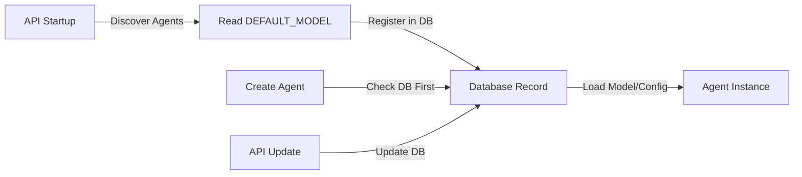

# External Agent Simple Pattern - Database-Aware

## Overview

External agents need to be simple with minimal boilerplate while working seamlessly with:
1. Database registration at API startup
2. Model configuration from database
3. API compatibility

## The Simple External Agent Pattern

### 1. Minimal External Agent Structure

```
my_external_agent/
├── __init__.py         # Factory function
├── agent.py            # Agent class with DEFAULT_MODEL
└── .env                # Optional: Package-specific env vars
```

### 2. Simple Agent Implementation

```python
# my_external_agent/agent.py
from automagik.agents.models.automagik_agent import AutomagikAgent

class MyExternalAgent(AutomagikAgent):
    """My external agent - just the logic."""
    
    # Declarative configuration - used at API startup
    DEFAULT_MODEL = "openai:gpt-4o-mini"
    DEFAULT_CONFIG = {
        "supported_media": ["text", "image"],
        "custom_setting": "value"
    }
    
    # Optional: External dependencies
    PACKAGE_ENV_FILE = ".env"
    EXTERNAL_API_KEYS = [("MY_API_KEY", "My service API key")]
    
    def __init__(self, config=None):
        super().__init__(config or {})
        self._code_prompt_text = "You are MyAgent..."
        self.dependencies = self.create_default_dependencies()
        self.tool_registry.register_default_tools(self.context)

# my_external_agent/__init__.py
from .agent import MyExternalAgent

def create_agent(config=None):
    return MyExternalAgent(config)
```

### 3. How It Works

#### At API Startup:
1. AgentFactory discovers `my_external_agent`
2. Reads `DEFAULT_MODEL` and `DEFAULT_CONFIG` from agent class
3. Registers in database with these defaults:
   ```json
   {
     "name": "my_external_agent",
     "model": "openai:gpt-4o-mini",
     "config": {
       "supported_media": ["text", "image"],
       "custom_setting": "value",
       "created_by": "auto_discovery"
     }
   }
   ```

#### When Agent is Created:
1. AgentFactory checks database first
2. Uses database model and config (source of truth)
3. Merges with any runtime config
4. Creates agent instance

#### Via API:
```python
# Change model via API
PUT /agents/my_external_agent/model
{
  "model": "openai:gpt-4o"
}

# Update config via API  
PUT /agents/my_external_agent/config
{
  "custom_setting": "new_value"
}

# Changes are stored in database
# Next agent creation uses updated values
```

## Complete Working Example

```python
# stan_agents/agent.py
from typing import Dict
from automagik.agents.models.automagik_agent import AutomagikAgent

class StanAgent(AutomagikAgent):
    """Stan agent for external pattern."""
    
    # Database defaults (registered at API startup)
    DEFAULT_MODEL = "openai:gpt-4o"
    DEFAULT_CONFIG = {
        "supported_media": ["text"],
        "requires_approval": True,
        "approval_statuses": ["APPROVED", "PENDING_REVIEW", "REJECTED"]
    }
    
    # External dependencies
    PACKAGE_ENV_FILE = ".env"
    EXTERNAL_API_KEYS = [
        ("STAN_API_KEY", "Stan platform API key"),
        ("BLACKPEARL_API_KEY", "BlackPearl API key")
    ]
    
    def __init__(self, config: Dict = None):
        super().__init__(config or {})
        
        # Agent logic
        self._code_prompt_text = self._get_prompt_for_status()
        self.dependencies = self.create_default_dependencies()
        
        # Register tools
        self.tool_registry.register_default_tools(self.context)
        self._register_stan_tools()
    
    def _get_prompt_for_status(self) -> str:
        """Get prompt based on user approval status."""
        # This could check database or API for user status
        status = self.config.get("user_status", "PENDING_REVIEW")
        
        prompts = {
            "APPROVED": "You are Stan with full capabilities...",
            "PENDING_REVIEW": "You are Stan in review mode...",
            "REJECTED": "Access limited. Please contact support..."
        }
        
        return prompts.get(status, prompts["PENDING_REVIEW"])
    
    def _register_stan_tools(self):
        """Register Stan-specific tools."""
        # Tool registration logic
        pass

# stan_agents/__init__.py
from .agent import StanAgent

def create_agent(config=None):
    return StanAgent(config)
```

## Key Benefits

1. **Minimal Boilerplate**: Just inherit and set class attributes
2. **Database Integration**: Automatic registration at startup
3. **API Compatible**: Models/configs updateable via API
4. **External Ready**: Works from any directory with AUTOMAGIK_EXTERNAL_AGENTS_DIR
5. **Environment Isolated**: Package-specific .env files
6. **Zero Config**: Works out of the box with sensible defaults

## Database Flow



## Summary

This pattern ensures:
- ✅ External agents remain simple (just a class with defaults)
- ✅ Database is the source of truth for runtime configuration
- ✅ Models can be updated via API without code changes
- ✅ Backward compatible with existing agents
- ✅ No complex registry or scattered functions needed

The key insight is using class attributes for defaults that get registered in the database at startup, then always using the database values at runtime.