# Automagik Agents System Architecture

## Executive Summary

Automagik Agents is a production-ready AI agent framework built over Pydantic AI that provides a robust foundation for creating, deploying, and managing AI agents. The system consists of three main architectural layers:

1. **Core Agent Framework**: Production-ready agent runtime with memory, tools, and API endpoints
2. **Claude Code Agent System**: Containerized Claude CLI execution for autonomous workflows  
3. **Genie Orchestrator**: Multi-workflow orchestration system with time machine capabilities *(Future)*

## 🏗️ Overall System Architecture

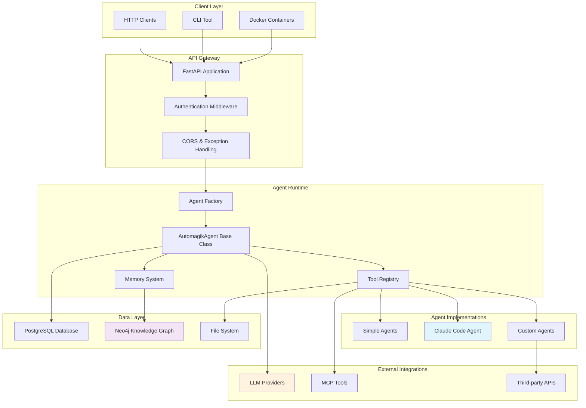

## 🤖 Core Agent Framework

### Agent Base Architecture

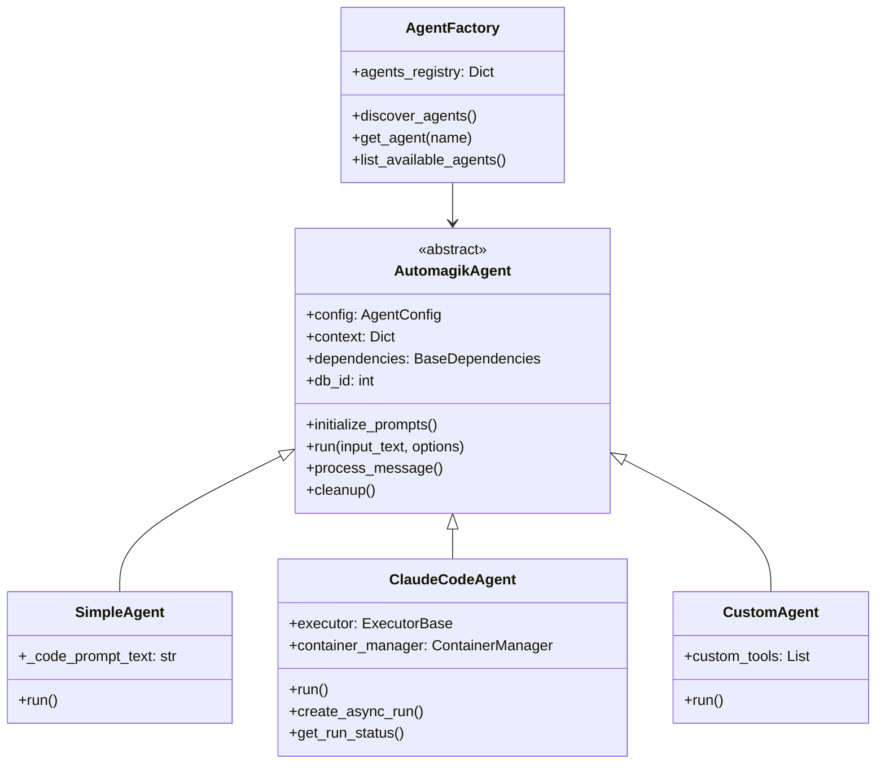

### Agent Lifecycle Flow

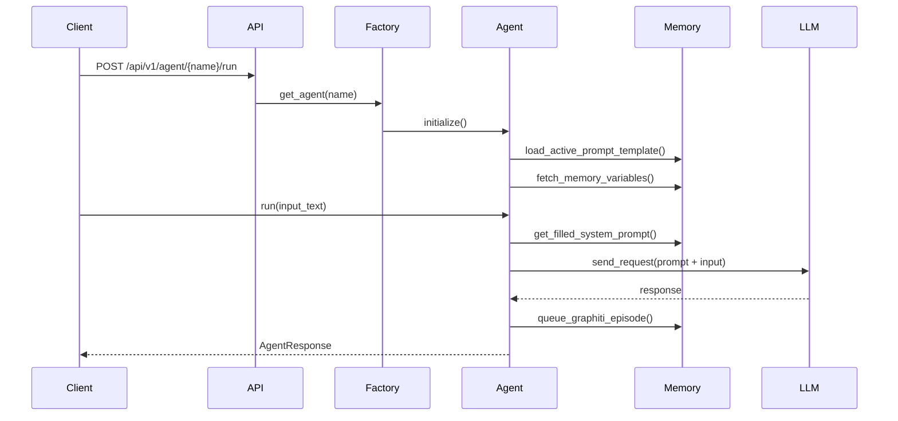

## 🐳 Claude Code Agent System

The Claude Code Agent represents a sophisticated container-based execution system for running Claude CLI in isolated environments.

### Container Execution Architecture

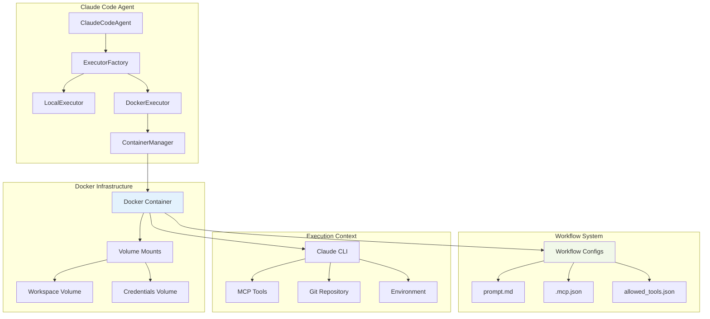

### Workflow Execution Flow

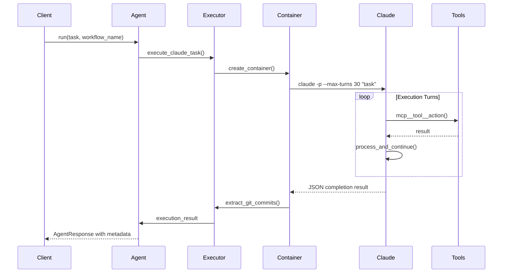

### Current Workflow Types

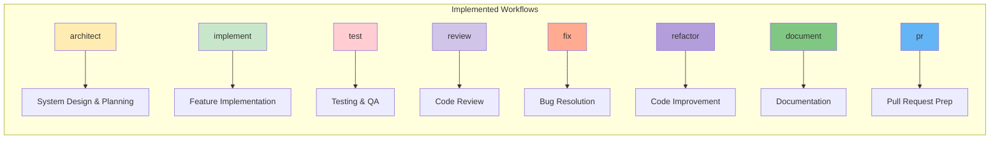

## 🧠 Memory & Knowledge System

### Memory Architecture

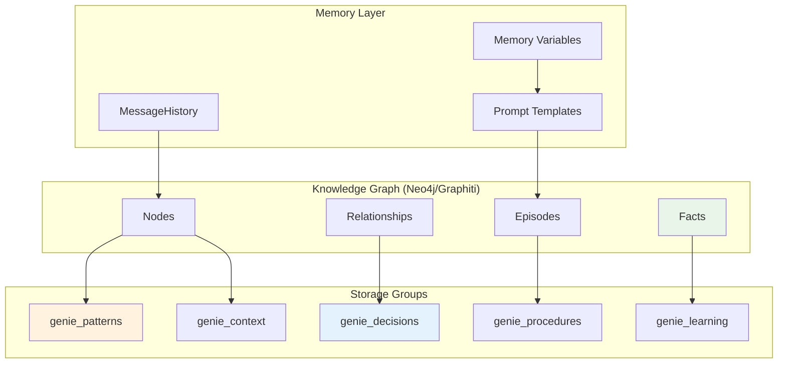

### Memory Integration Flow

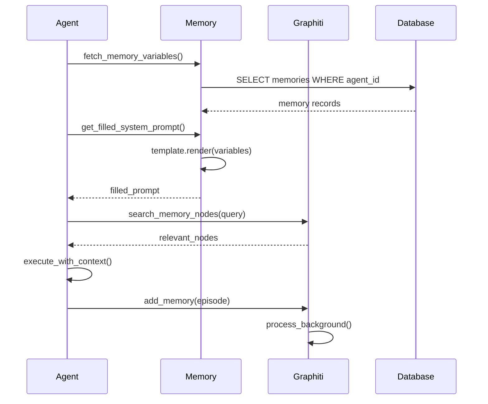

## 🎭 Genie Orchestrator System *(Future Architecture)*

The Genie system represents the next evolution - a multi-workflow orchestration platform with time machine capabilities.

### Genie Architecture Overview

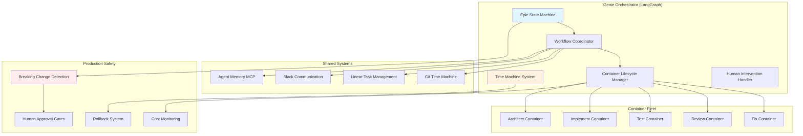

### Epic Workflow Orchestration

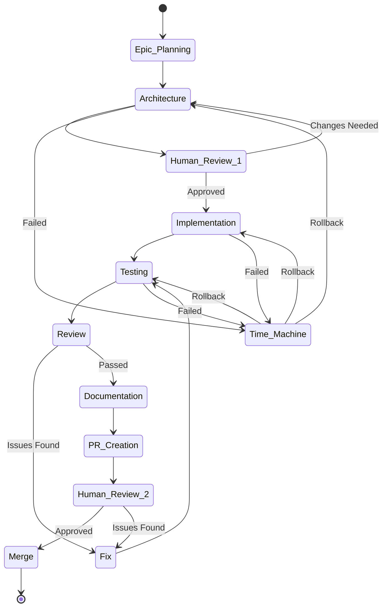

### Container Time Machine System

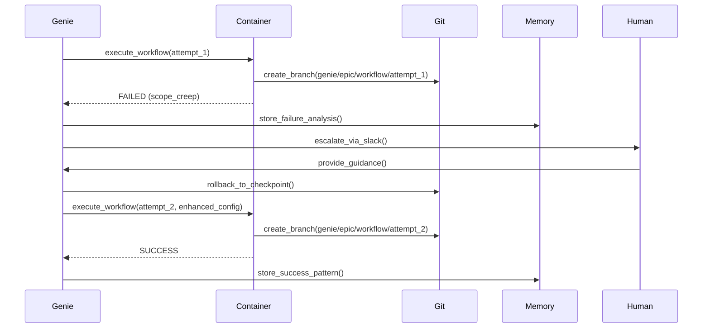

## 🛠️ Tool Integration & MCP System

### Tool Architecture

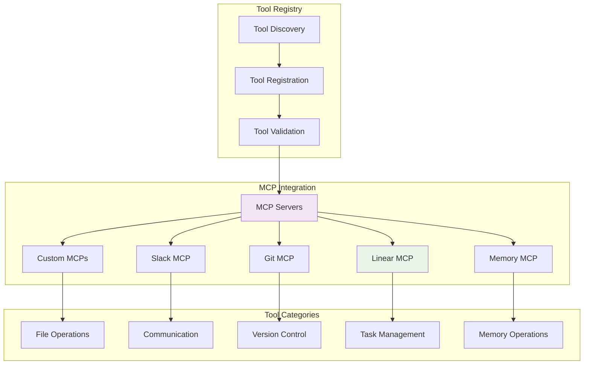

## 🔐 Security & Production Safety

### Security Architecture

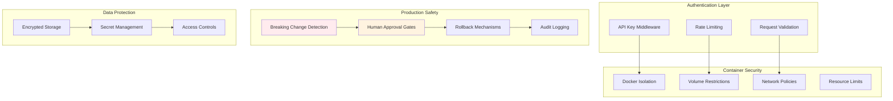

## 📊 Data Flow & Storage

### Database Schema Overview

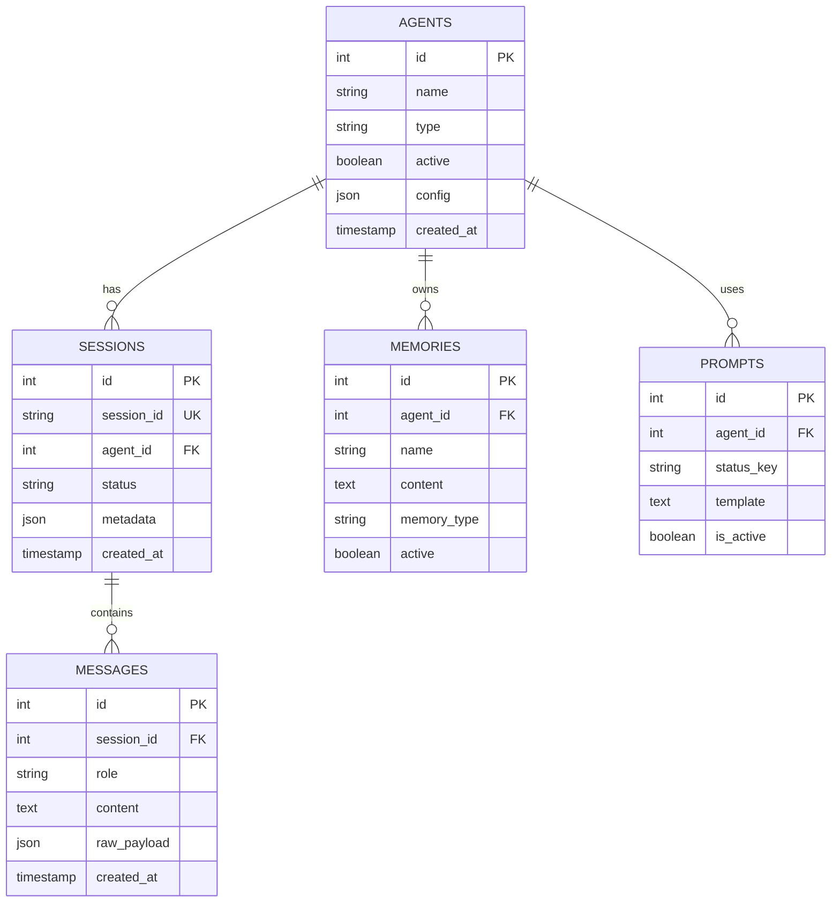

## 🚀 Deployment Architecture

### Production Deployment

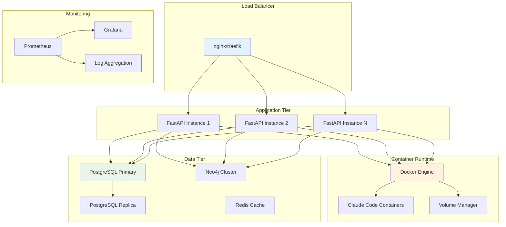

## 🔄 Development Workflow

### Local Development Setup

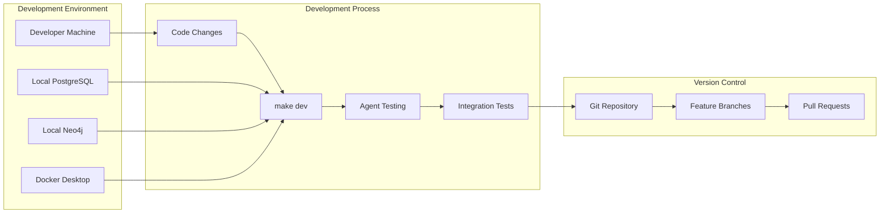

## 📈 Scalability Considerations

### Horizontal Scaling Strategy

```mermaid
graph TB
    subgraph "API Layer Scaling"
        A[Load Balancer]
        B[Auto Scaling Group]
        C[Health Checks]
    end
    
    subgraph "Container Scaling"
        D[Container Orchestrator]
        E[Resource Quotas]
        F[Queue Management]
    end
    
    subgraph "Database Scaling"
        G[Read Replicas]
        H[Connection Pooling]
        I[Caching Layer]
    end
    
    subgraph "Memory System Scaling"
        J[Neo4j Cluster]
        K[Graph Sharding]
        L[Query Optimization]
    end
    
    A --> B
    B --> C
    D --> E
    E --> F
    G --> H
    H --> I
    J --> K
    K --> L
```

## 🎯 Key Architectural Principles

### Design Philosophy

1. **Modularity**: Each component is independently replaceable and testable
2. **Extensibility**: New agent types and tools can be added without core changes
3. **Production Safety**: Built-in safeguards for production environments with hundreds of clients
4. **Memory-Driven**: Knowledge graph enables learning and context persistence
5. **Container Isolation**: Secure, reproducible execution environments
6. **Human-in-the-Loop**: Strategic decision points for human oversight
7. **Time Machine**: Complete rollback and learning capabilities for failed executions

### Technical Stack

- **Backend**: FastAPI + Pydantic AI + PostgreSQL + Neo4j
- **Container Runtime**: Docker + Claude CLI
- **Memory System**: Graphiti Knowledge Graph
- **Communication**: Slack + Linear + MCP Protocol
- **Orchestration**: LangGraph (Future Genie System)
- **Security**: API Keys + Docker Isolation + Rate Limiting

---

This architecture enables rapid development of production-ready AI agents while maintaining the flexibility to scale from simple chatbots to sophisticated multi-workflow orchestration systems. The Claude Code Agent represents the evolution toward autonomous container-based AI workflows, with the future Genie system providing enterprise-grade orchestration capabilities. 