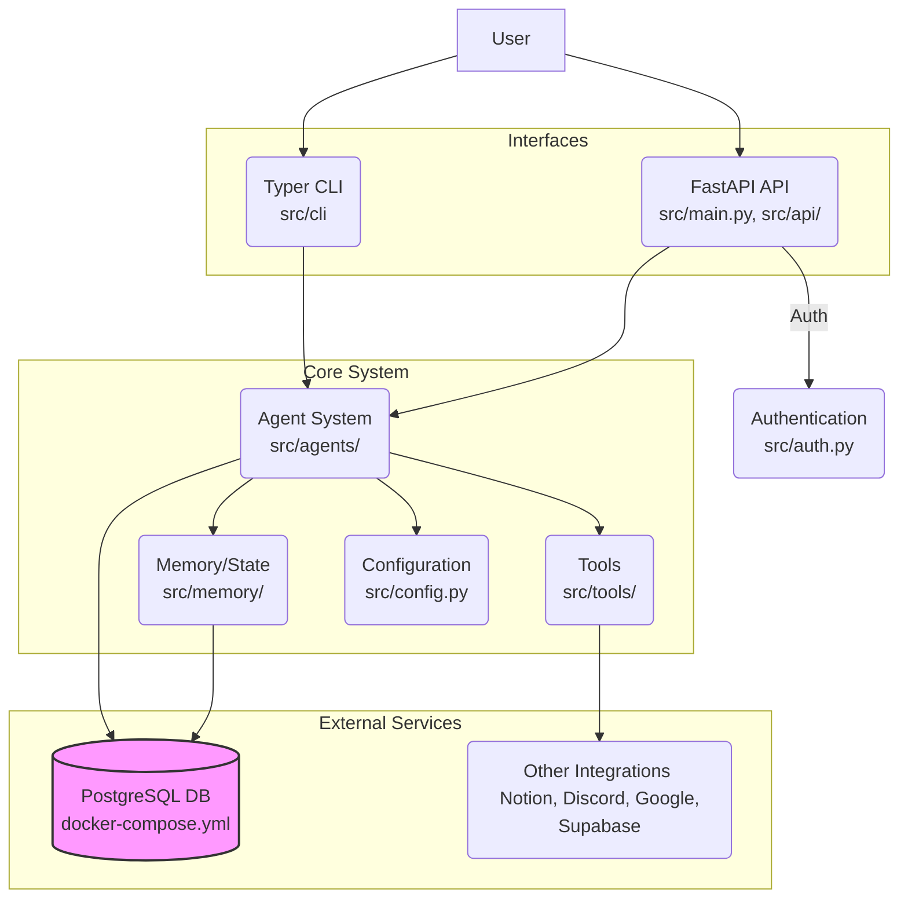

# Architecture

This document provides a high-level overview of the Automagik Agents project architecture. It outlines the main components and how they interact.

## Overview

The project is a Python application designed to run AI agents (Automagik Agents). It offers both a web API interface (built with FastAPI) and a command-line interface (built with Typer). The core logic resides in the agent system, which leverages configurations, interacts with a database for persistence (likely including agent memory/state), and utilizes various tools. Docker is used to manage external services like the PostgreSQL database.



## Components

1.  **Interfaces:**
    *   **FastAPI API (`src/api/`, `src/main.py`):** Provides an HTTP-based interface to interact with the system, likely for managing or triggering agents. It uses `uvicorn` as the ASGI server. Requires authentication (`src/auth.py`). See [API Documentation](../development/api.md).
    *   **Typer CLI (`src/cli/`, `src/cli.py`):** Offers a command-line interface for interaction, potentially for development, testing, or running specific agent tasks. Accessible via the `automagik agents` command. See [Running the Project](../getting-started/running.md).

2.  **Core System:**
    *   **Agent System (`src/agents/`):** The heart of the application, containing the logic for different AI agents. Likely uses libraries like `pydantic-ai` for structuring agent interactions. See [Agent System Overview](../development/agents-overview.md) for more details.
    *   **Memory/State (`src/memory/`):** Manages the persistent state and conversation history of agents. Likely interacts heavily with the database. See [Memory Management](./memory.md) for more details.
    *   **Tools (`src/tools/`):** Reusable functionalities that agents can utilize. Examples might include web search (like the integrated DuckDuckGo tool), interacting with external APIs (Notion, Discord, Google, Supabase), or specific data processing utilities.
    *   **Configuration (`src/config.py`):** Centralizes all project settings using `pydantic-settings`. Loads configuration from environment variables (`.env`). See [Configuration](../getting-started/configuration.md) for more details.
    *   **Authentication (`src/auth.py`):** Handles authentication logic, primarily for securing the FastAPI API endpoints.

3.  **Persistence:**
    *   **PostgreSQL Database (`src/db/`, `docker-compose.yml`):** The primary data store, managed via Docker Compose. Used for storing application data, potentially including agent configurations, memory, logs, and user data. See [Database](./database.md) for more details.

4.  **Utilities (`src/utils/`):** Contains general helper functions and utility code used across different components.

## Interactions & Data Flow

- Users interact either via the **CLI** or the **API**.
- Both interfaces typically trigger actions within the **Agent System**.
- The **API** uses the **Authentication** module to secure endpoints.
- **Agents** access **Configuration** for settings.
- **Agents** utilize **Tools** to perform specific actions or interact with external services.
- **Agents** read from and write to the **Memory/State** module to maintain context.
- The **Memory/State** module persists data to the **PostgreSQL Database**.
- **Agents** may also directly interact with the **PostgreSQL Database** for other data needs via the `src/db/` module.

## Design Patterns & Concepts

- **Configuration Management:** Centralized configuration via `src/config.py` and environment variables (see `config-rules`).
- **Dependency Injection:** FastAPI heavily relies on dependency injection, which might be used throughout the API layer.
- **Modular Design:** The separation into `api`, `cli`, `agents`, `db`, `memory`, `tools`, and `utils` suggests a modular approach.

## Advanced Architectural Patterns

### Multi-Agent Orchestration

The framework supports sophisticated multi-agent coordination patterns:

#### PydanticAI + LangGraph Integration
- **Structured Interactions**: PydanticAI provides type-safe agent interfaces
- **Stateful Workflows**: LangGraph manages complex workflow state
- **Persistent Execution**: Workflows can be interrupted and resumed
- **Human-in-the-Loop**: Built-in approval checkpoints for critical decisions

#### Dual State Management

```text
┌─────────────────────┐    ┌─────────────────────┐
│   PostgreSQL        │    │   MCP Memory        │
│   (Operational)     │    │   (Learning)        │
├─────────────────────┤    ├─────────────────────┤
│ • Session state     │    │ • Pattern storage   │
│ • Workflow progress │    │ • Decision history  │
│ • Message history   │    │ • Failure analysis  │
│ • Agent assignments │    │ • Success patterns  │
└─────────────────────┘    └─────────────────────┘
```

- **Operational State**: PostgreSQL for transactional data, session management, and workflow progress
- **Learning State**: MCP agent-memory for accumulated knowledge, patterns, and retrospectives
- **Synchronization**: Automatic sync between operational and learning systems

### Communication Architecture

#### Thread-Based Coordination
- **Slack Integration**: Multi-agent communication through organized Slack threads
- **Status Broadcasting**: Structured status updates with emoji-based categorization
- **Human Escalation**: Automatic escalation of critical decisions to human stakeholders
- **Audit Trail**: Complete communication history for compliance and debugging

#### Natural Language Routing
- **Task Analysis**: Decompose complex requests into structured components
- **Agent Selection**: Match task components to agent capabilities
- **Dynamic Routing**: Route tasks to appropriate agents based on current availability and expertise

### Reliability Patterns

#### Cost Control and Monitoring
- **Pre-execution Estimation**: Cost prediction before workflow execution
- **Runtime Tracking**: Real-time monitoring of computational costs
- **Circuit Breakers**: Automatic halt when cost thresholds are exceeded
- **Budget Management**: Per-project and per-agent cost allocation

#### Rollback and Recovery
- **Multi-level Recovery**: Step, state, snapshot, and full recovery options
- **Git Integration**: Automatic snapshots for code state recovery
- **Checkpoint Management**: LangGraph state checkpoints for workflow recovery
- **Graceful Degradation**: Continue with reduced functionality when components fail

#### Error Handling
- **Circuit Breaker Pattern**: Prevent cascade failures by temporarily disabling failing agents
- **Retry with Backoff**: Intelligent retry mechanisms for transient failures
- **Fallback Strategies**: Alternative execution paths when primary agents fail

### Performance Optimization

#### Async Execution
- **Non-blocking Operations**: Long-running workflows don't block client requests
- **Status Polling**: Real-time progress updates through polling endpoints
- **Background Processing**: Heavy operations executed in background workers

#### Resource Management
- **Connection Pooling**: Efficient database and external service connections
- **Rate Limiting**: Built-in rate limiting for external APIs
- **Parallel Execution**: Concurrent execution of independent tasks
- **Caching Strategies**: Intelligent caching of expensive operations

### Security Architecture

#### Authentication and Authorization
- **JWT-based Auth**: Secure token-based authentication
- **Role-based Access**: Different permission levels for different user types
- **API Key Management**: Secure storage and rotation of external API keys

#### Data Protection
- **Encryption at Rest**: Sensitive data encrypted in database
- **Secure Communication**: TLS for all external communications
- **Audit Logging**: Comprehensive audit trail for security events

## Architectural Decision Framework

The framework includes a systematic approach for making and documenting architectural decisions:

- **ADR Process**: Architecture Decision Records for major decisions
- **Risk Assessment**: Structured evaluation of technical and business risks
- **Decision Criteria**: Weighted scoring system for evaluating alternatives
- **Review Process**: Regular review and update of architectural decisions

See [Decision Framework](./decision-framework.md) for detailed process documentation.

## Deployment Architectures

### Development Environment
- **Local Development**: UV-based Python environment with local PostgreSQL
- **Docker Development**: Containerized stack for consistent development
- **Hot Reload**: Automatic reloading for rapid development cycles

### Production Environment
- **Container Orchestration**: Docker-based deployment with health checks
- **Service Management**: Systemd integration for production services
- **Monitoring**: Comprehensive monitoring and alerting
- **Backup Strategy**: Automated backups of data and configurations

## Scalability Considerations

### Horizontal Scaling
- **Stateless Design**: Application components designed to be stateless
- **Database Scaling**: PostgreSQL clustering and read replicas
- **Load Balancing**: Built-in support for load balancer integration

### Vertical Scaling
- **Resource Optimization**: Efficient memory and CPU usage patterns
- **Database Optimization**: Query optimization and indexing strategies
- **Caching Layers**: Multiple levels of caching for performance

## Integration Patterns

### External Service Integration
- **MCP Protocol**: Standardized tool discovery and execution
- **API Abstraction**: Consistent interfaces for external services
- **Retry Logic**: Built-in retry and error handling for external calls

### Event-Driven Architecture
- **Asynchronous Processing**: Event-driven patterns for loose coupling
- **Message Queuing**: Support for message queue integration
- **Webhook Support**: Incoming webhook handling for external integrations

(Further details on specific design patterns can be added as the project evolves or during deeper code analysis.) 