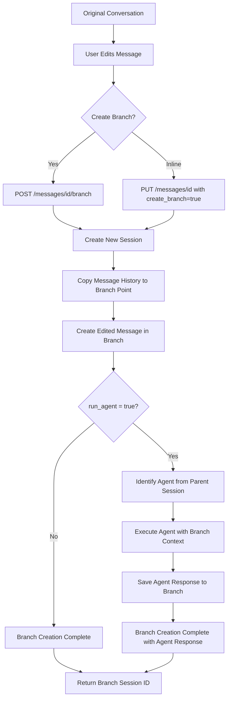
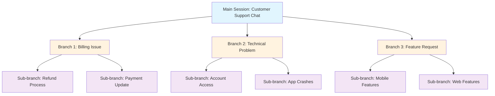
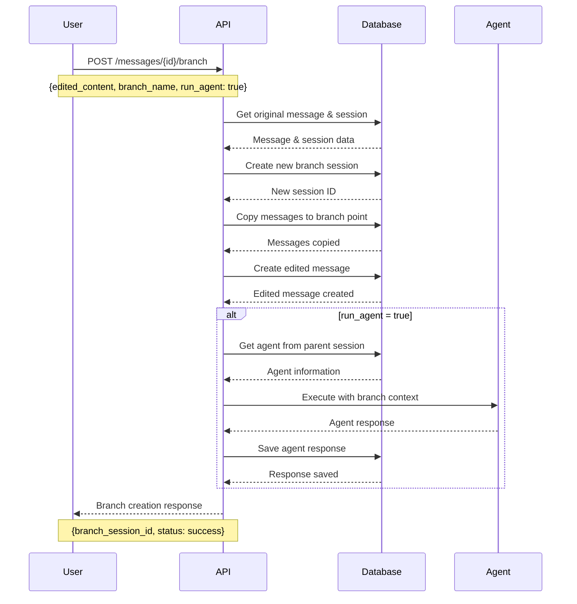
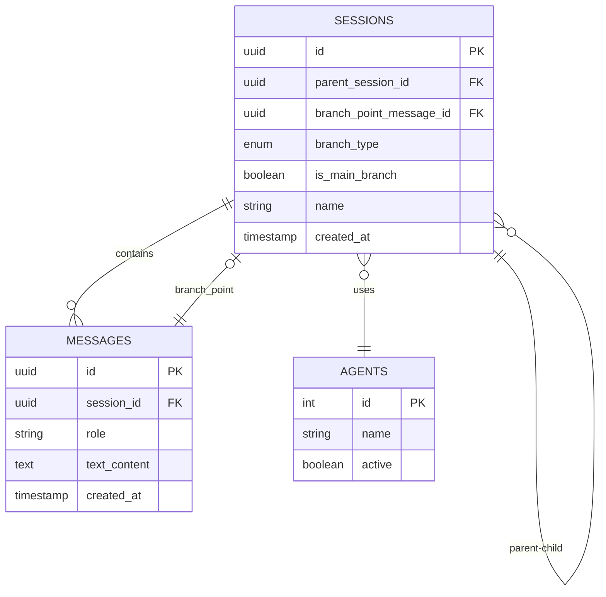
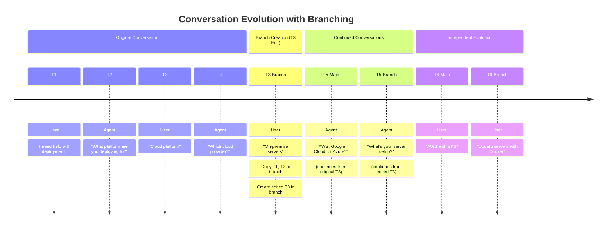
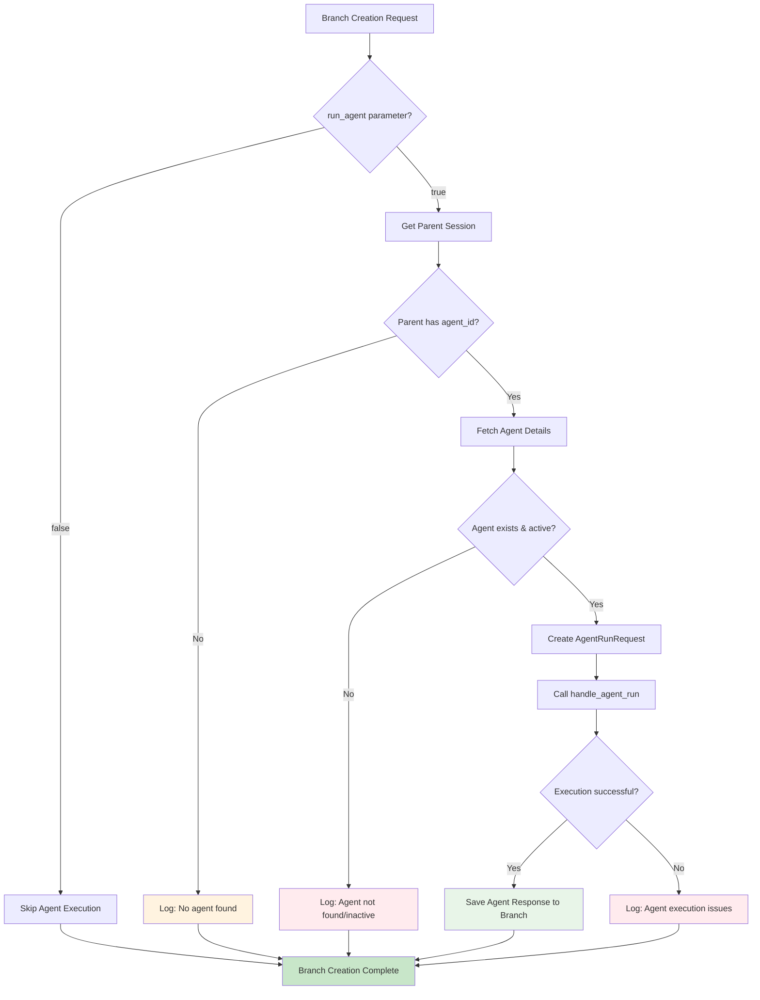
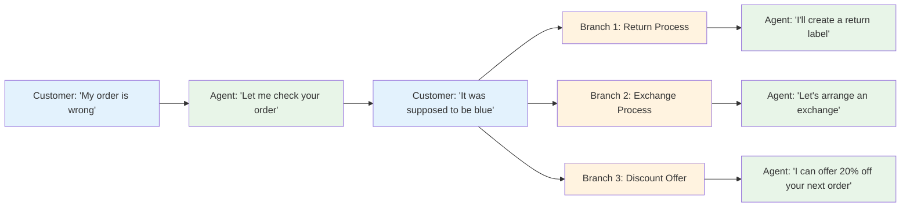
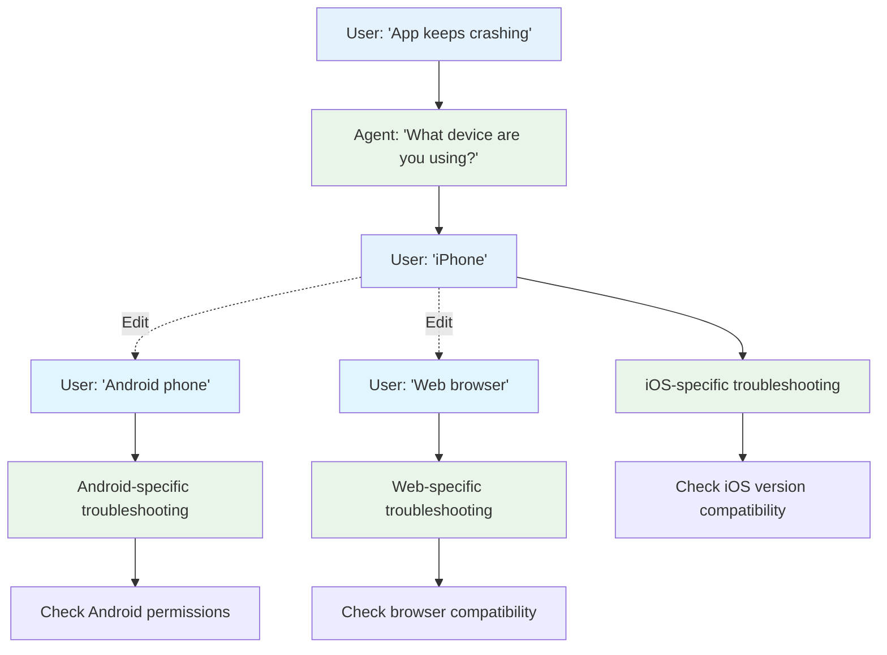
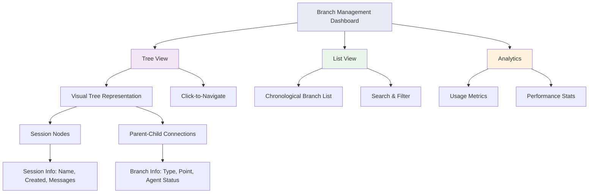
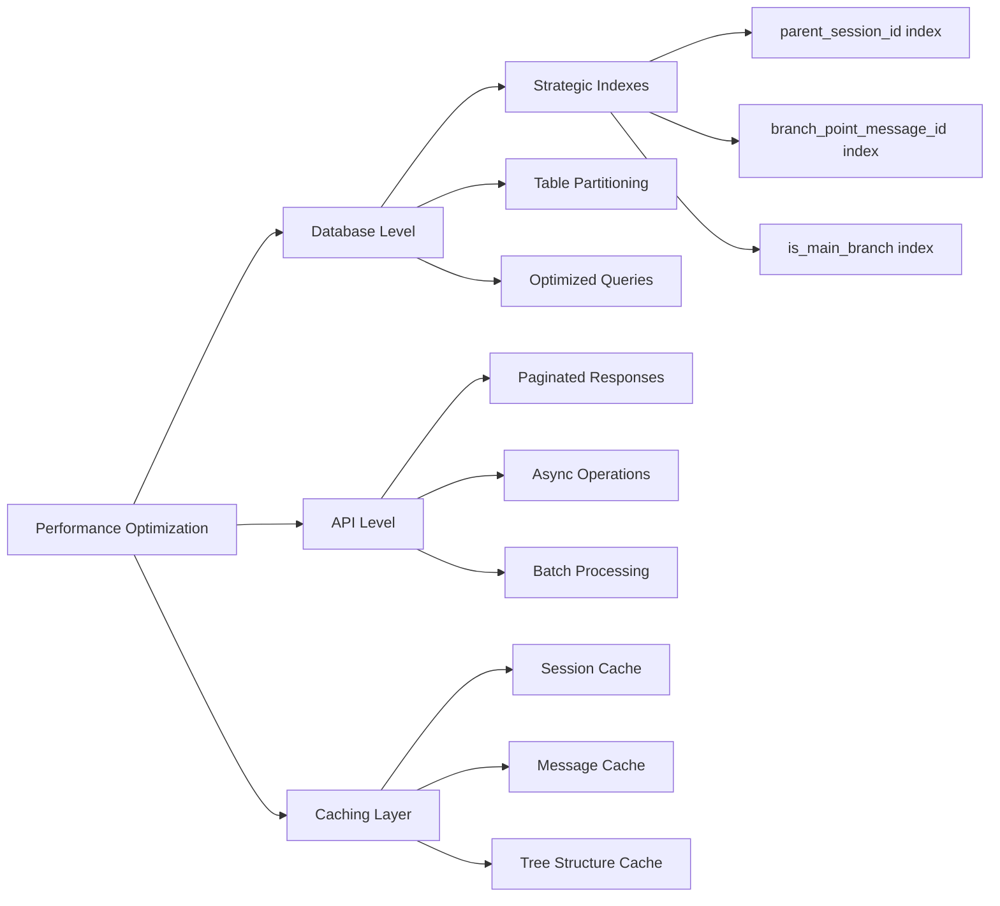

# Conversation Branching - Visual Diagrams

## Complete Branching Flow Diagram

## Session Tree Structure

## API Interaction Flow

## Database Relationship Diagram

## Message Flow Timeline

## Agent Execution Decision Tree

## Branching Use Case Examples

### Example 1: Customer Support Escalation

### Example 2: Technical Troubleshooting

## Branch Management Dashboard Concept

## Performance Optimization Strategies

These diagrams provide comprehensive visual documentation for the conversation branching feature, covering everything from high-level flows to detailed technical implementation and use cases.