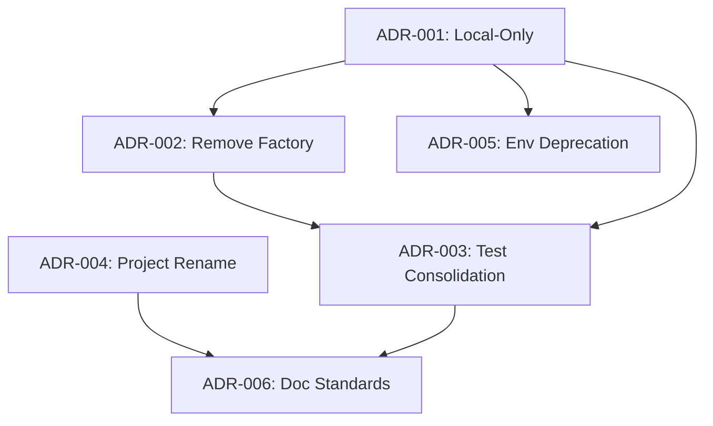

# Architecture Decisions Record
## Epic: release-prep-v0.2.0

### Decision Matrix Overview

| ADR | Decision | Status | Risk | Dependencies |
|-----|----------|--------|------|--------------|
| ADR-001 | Local-Only Execution | Approved | Medium | None |
| ADR-002 | Remove ExecutorFactory | Approved | Low | ADR-001 |
| ADR-003 | Test Suite Consolidation | Approved | Medium | ADR-001,002 |
| ADR-004 | Project Rename | Pending | Low | None |
| ADR-005 | Environment Deprecation | Approved | Low | ADR-001 |
| ADR-006 | Documentation Standards | Approved | Low | All |

---

### ADR-001: Local-Only Execution Architecture

**Status**: ✅ Approved  
**Date**: 2025-01-13  
**Risk Level**: Medium  

#### Context
Claude Code currently supports dual execution modes (Docker and local) with incomplete Docker implementation. The Docker mode adds significant complexity without providing immediate value.

#### Decision
Transform Claude Code to support **local execution only**, removing all Docker/container-related code and infrastructure.

#### Rationale
- **Incomplete Implementation**: Docker mode not fully functional
- **Complexity Reduction**: Dual-mode architecture adds unnecessary complexity
- **Development Velocity**: Local-only focus accelerates development
- **Maintenance Overhead**: Two execution paths increase technical debt
- **Testing Simplicity**: Single execution mode enables focused testing

#### Implementation Impact
- Remove `container.py`, `docker_executor.py`, `docker/` directory (~1,000+ lines)
- Simplify `agent.py` initialization logic
- Consolidate test suite to local execution focus
- Update documentation to reflect local-only architecture

#### Success Metrics
- Codebase reduction of 1,000+ lines
- Test execution time improvement of 20%+
- Simplified architecture with clear execution path

---

### ADR-002: ExecutorFactory Pattern Removal

**Status**: ✅ Approved  
**Date**: 2025-01-13  
**Risk Level**: Low  
**Dependencies**: ADR-001

#### Context
`ExecutorFactory` implements factory pattern to choose between Docker and local executors. With local-only architecture, this becomes unnecessary complexity.

#### Decision
**Remove ExecutorFactory entirely** and use direct `LocalExecutor` instantiation in `ClaudeCodeAgent`.

#### Rationale
- **Over-Engineering**: Factory pattern unnecessary for single implementation
- **Direct Instantiation**: Simpler and more transparent
- **Reduced Indirection**: Easier to debug and understand
- **YAGNI Principle**: Current needs don't justify factory complexity

#### Implementation
```python
# BEFORE:
self.executor = ExecutorFactory.create_executor(
    mode=self.execution_mode,
    container_manager=self._create_container_manager() if self.execution_mode == "docker" else None,
    workspace_base=os.environ.get("CLAUDE_LOCAL_WORKSPACE", "/tmp/claude-workspace"),
    cleanup_on_complete=os.environ.get("CLAUDE_LOCAL_CLEANUP", "true").lower() == "true"
)

# AFTER:
self.executor = LocalExecutor(
    workspace_base=os.environ.get("CLAUDE_LOCAL_WORKSPACE", "/tmp/claude-workspace"),
    cleanup_on_complete=os.environ.get("CLAUDE_LOCAL_CLEANUP", "true").lower() == "true",
    git_cache_enabled=os.environ.get("CLAUDE_LOCAL_GIT_CACHE", "false").lower() == "true"
)
```

---

### ADR-003: Test Suite Consolidation Strategy

**Status**: ✅ Approved  
**Date**: 2025-01-13  
**Risk Level**: Medium  
**Dependencies**: ADR-001, ADR-002

#### Context
Current test suite contains mixed concerns with Docker and local execution tests intermingled, creating confusion and maintenance overhead.

#### Decision
**Consolidate test suite** to focus exclusively on local execution with enhanced coverage of local-specific scenarios.

#### Implementation Strategy
1. **Remove**: `test_container.py` (534 lines) and Docker test methods
2. **Consolidate**: Merge overlapping local execution tests
3. **Enhance**: Add comprehensive local execution edge cases
4. **Optimize**: Improve test performance and reliability

#### Quality Gates
- Maintain minimum 85% code coverage
- Achieve 20%+ improvement in test execution time
- Eliminate Docker dependencies in test environment
- Enhance local execution edge case coverage

#### Risk Mitigation
- Comprehensive coverage analysis before/after cleanup
- Enhanced local test scenarios to replace Docker coverage
- Performance benchmarking throughout consolidation

---

### ADR-004: Project Rename Implementation

**Status**: ⏳ Pending Approval  
**Date**: 2025-01-13  
**Risk Level**: Low  

#### Context
Current project name "automagik-agents" is verbose and the "-agents" suffix may limit perception of platform capabilities.

#### Decision
Rename project from **"automagik-agents"** to **"automagik"** for 0.2 release.

#### Rationale
- **Simplicity**: Shorter, more memorable name
- **Brand Clarity**: Better represents platform vision
- **Flexibility**: Allows expansion beyond agents
- **Marketing**: More appealing and professional

#### Implementation Scope
```toml
# pyproject.toml changes
[project]
name = "automagik"  # was "automagik-agents"
description = "Automagik AI agent framework and orchestration platform"
```

#### Migration Strategy
- Update package metadata and URLs
- Search/replace hardcoded references
- Update documentation and installation guides
- Maintain compatibility during transition

---

### ADR-005: Environment Variable Deprecation

**Status**: ✅ Approved  
**Date**: 2025-01-13  
**Risk Level**: Low  
**Dependencies**: ADR-001

#### Context
`CLAUDE_CODE_MODE` environment variable becomes obsolete with local-only architecture, but immediate removal might break existing configurations.

#### Decision
**Mark `CLAUDE_CODE_MODE` as deprecated** with graceful handling and warning messages.

#### Implementation
```python
# Graceful deprecation in agent initialization
if os.environ.get("CLAUDE_CODE_MODE") == "docker":
    logger.warning(
        "CLAUDE_CODE_MODE=docker is deprecated. "
        "Claude Code now runs in local mode only. "
        "This variable will be ignored. "
        "Support will be removed in v0.3.0"
    )
```

#### Deprecation Timeline
- **v0.2.0**: Deprecation warnings introduced
- **v0.3.0**: Environment variable support removed entirely

---

### ADR-006: Epic Documentation Standards

**Status**: ✅ Approved  
**Date**: 2025-01-13  
**Risk Level**: Low  
**Dependencies**: All other ADRs

#### Context
Current epic documentation is chaotic with 17 files and no clear organization, making navigation and maintenance difficult.

#### Decision
**Establish standardized epic documentation workflow** with predefined structure and naming conventions.

#### Documentation Structure
```
docs/development/{epic-id}/
├── 00-EPIC_OVERVIEW.md           # Epic summary and scope
├── 01-ARCHITECTURE_DECISIONS.md  # Consolidated ADRs
├── 02-IMPLEMENTATION_PLAN.md     # Detailed execution roadmap
├── 03-RISK_ANALYSIS.md          # Risk assessment and mitigation
├── 04-BREAKING_CHANGES.md       # Breaking changes analysis
├── 05-VALIDATION_CRITERIA.md    # Success metrics and tests
├── 99-COMPLETION_REPORT.md      # Final status and handoff
└── archives/                    # Archived iterations/drafts
```

#### Quality Standards
- Maximum 7 core documents per epic
- Numbered prefixes (00-99) for reading order
- Single purpose per document, no duplication
- Clear cross-references between documents
- Comprehensive handoff documentation

---

### Breaking Changes Analysis

#### API Level Changes: NONE
- Local execution API remains unchanged
- Workflow configurations unchanged
- Environment variables for local mode preserved

#### Configuration Changes: MINIMAL
- `CLAUDE_CODE_MODE=docker` ignored with deprecation warning
- All local configuration options remain functional
- Graceful degradation prevents breaking existing setups

#### Deployment Changes: MINIMAL
- Docker deployment options removed (affects Docker users only)
- Local deployment requirements unchanged
- Clear migration path provided for affected users

### Risk Assessment Summary

**High Confidence Decisions** (Low Risk):
- ADR-002: ExecutorFactory removal (well-isolated change)
- ADR-004: Project rename (metadata changes only)
- ADR-005: Environment deprecation (graceful handling)
- ADR-006: Documentation standards (process improvement)

**Medium Confidence Decisions** (Medium Risk):
- ADR-001: Local-only architecture (potential hidden dependencies)
- ADR-003: Test consolidation (coverage maintenance required)

### Implementation Dependencies



### Human Approval Requirements

**Technical Approvals** (Already Granted):
- ✅ Local-only architecture transformation
- ✅ ExecutorFactory pattern removal
- ✅ Test suite consolidation approach
- ✅ Environment variable deprecation strategy

**Business Approvals** (Pending):
- ⏳ Project rename from "automagik-agents" to "automagik"
- ⏳ Breaking changes communication strategy
- ⏳ User migration timeline and support approach

These architectural decisions provide a comprehensive foundation for the 0.2 release transformation while maintaining system stability and user experience.