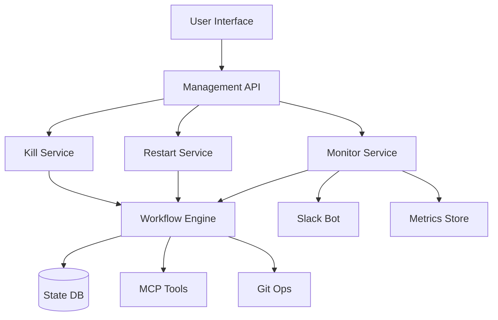

# Linear Epic: Comprehensive Workflow Management System

## Epic Title
🔄 Workflow Management System: Kill, Restart, and Monitoring

## Epic Description

Implement a comprehensive workflow management system that provides full lifecycle control over Claude Code workflows. This system will enable users to kill stuck workflows, restart failed ones, and monitor execution in real-time, significantly improving the reliability and usability of our autonomous agent platform.

### Problem Statement

Currently, workflows can become stuck or fail without clear remediation paths. Users lack visibility into workflow status and cannot intervene when issues arise. This leads to:
- Wasted compute resources on stuck workflows
- Inability to stop runaway processes
- No recovery mechanism for transient failures
- Limited debugging capabilities
- Poor user experience during failures

### Solution Overview

Build a robust workflow management system with three core capabilities:

1. **Kill Functionality**: Safe, controlled termination of workflows
2. **Restart Capability**: Intelligent restart with state preservation
3. **Real-time Monitoring**: Comprehensive visibility and alerting

### Success Criteria

- ✅ Any workflow can be safely terminated within 10 seconds
- ✅ Failed workflows can be restarted from checkpoints
- ✅ Real-time status visible in Slack and web dashboard
- ✅ 99% kill success rate
- ✅ Zero data loss during termination
- ✅ Automated monitoring with intelligent alerts

## Technical Architecture

### System Components

### Key Features

1. **Workflow Kill System**
   - Graceful termination with 5s timeout
   - Force kill after grace period
   - Resource cleanup guarantee
   - Critical section protection
   - Audit trail of all terminations

2. **Workflow Restart System**
   - Checkpoint-based recovery
   - Intelligent retry strategies
   - State preservation
   - Dependency validation
   - Failure analysis

3. **Monitoring Dashboard**
   - Real-time workflow status
   - Resource utilization graphs
   - Performance metrics
   - Alert configuration
   - Historical analysis

## Subtasks Breakdown

### Phase 1: Kill Functionality (BUILDER)
- [ ] Implement kill command handler
- [ ] Build termination state machine
- [ ] Add resource cleanup system
- [ ] Create critical section protection
- [ ] Implement Slack integration
- [ ] Add API endpoints
- [ ] Write comprehensive tests

### Phase 2: Restart Capability (ARCHITECT + BUILDER)
- [ ] Design checkpoint system
- [ ] Implement state serialization
- [ ] Build restart orchestrator
- [ ] Add retry strategies
- [ ] Create failure analysis
- [ ] Implement rollback mechanism
- [ ] Add configuration options

### Phase 3: Monitoring System (LINA + BRAIN)
- [ ] Design monitoring architecture
- [ ] Implement metric collection
- [ ] Build real-time dashboard
- [ ] Create alert system
- [ ] Add Slack bot features
- [ ] Implement trend analysis
- [ ] Build automation rules

### Phase 4: Integration Testing (GUARDIAN)
- [ ] End-to-end kill scenarios
- [ ] Restart reliability testing
- [ ] Monitor accuracy validation
- [ ] Performance benchmarking
- [ ] Chaos engineering tests
- [ ] Security validation
- [ ] Documentation completion

### Phase 5: Deployment (SHIPPER)
- [ ] Staging environment setup
- [ ] Progressive rollout plan
- [ ] Monitoring setup
- [ ] Runbook creation
- [ ] Team training
- [ ] Go-live execution
- [ ] Post-deployment validation

## Team Assignments

### Core Development
- **BUILDER**: Kill functionality implementation
- **ARCHITECT**: System design and restart architecture
- **SURGEON**: Code optimization and performance

### Support Functions
- **LINA**: Monitoring system and autonomous operations
- **BRAIN**: Intelligent retry strategies and ML integration
- **GUARDIAN**: Testing, validation, and safety checks
- **SHIPPER**: Deployment and production readiness
- **GENIE**: Documentation and knowledge management

## Risk Mitigation

### Technical Risks
1. **Data Loss During Kill**
   - Mitigation: Implement transactional boundaries
   - Owner: BUILDER

2. **Cascading Failures**
   - Mitigation: Dependency isolation
   - Owner: ARCHITECT

3. **Performance Impact**
   - Mitigation: Async operations, resource limits
   - Owner: SURGEON

### Operational Risks
1. **Accidental Kills**
   - Mitigation: Permission system, confirmations
   - Owner: GUARDIAN

2. **Monitoring Overhead**
   - Mitigation: Sampling, aggregation
   - Owner: LINA

## Dependencies

- Claude Code workflow engine
- MCP tool infrastructure
- Slack API access
- Database for state management
- Metrics collection system
- Git integration for checkpoints

## Timeline

- **Week 1-2**: Kill functionality (BUILDER)
- **Week 3-4**: Restart capability (ARCHITECT + BUILDER)
- **Week 5-6**: Monitoring system (LINA + BRAIN)
- **Week 7**: Integration testing (GUARDIAN)
- **Week 8**: Deployment (SHIPPER)

## Success Metrics

### Immediate (Week 1)
- Kill command functional
- Basic state tracking
- Slack notifications

### Short-term (Month 1)
- Full kill system deployed
- Restart POC complete
- Basic monitoring active

### Long-term (Quarter)
- Complete system in production
- 99.9% reliability achieved
- Full automation enabled
- Team fully trained

## Related Work

- Existing workflow engine
- MCP wait tools
- Agent memory system
- Slack bot infrastructure
- Git operations framework