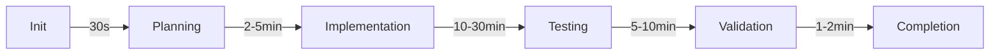

# Autonomous Workflow Monitoring Strategy

## Overview

This document defines the monitoring patterns and strategies for autonomous workflow management, incorporating learnings from wait tool implementations and phase-based timing requirements.

## Phase-Based Timing Patterns

### Workflow Lifecycle Phases



### 1. Initialization Phase (0-30 seconds)
- **Purpose**: Setup, dependency loading, context gathering
- **Monitoring**: 
  - Check every 5 seconds
  - Alert if > 45 seconds
  - Auto-retry after 60 seconds
- **Wait Pattern**: Non-blocking timer with progress

### 2. Planning Phase (30s-2min)
- **Purpose**: Task decomposition, strategy formulation
- **Monitoring**:
  - Check every 15 seconds
  - Warn at 3 minutes
  - Escalate at 5 minutes
- **Wait Pattern**: Blocking wait with intervals

### 3. Implementation Phase (2-30 minutes)
- **Purpose**: Core work execution
- **Monitoring**:
  - Check every 30 seconds
  - Progress updates required every 2 minutes
  - Adaptive timeout based on complexity
- **Wait Pattern**: Non-blocking with progress callbacks

### 4. Testing Phase (10-30 minutes)
- **Purpose**: Validation, test execution
- **Monitoring**:
  - Check every minute
  - Test progress tracking
  - Failure threshold monitoring
- **Wait Pattern**: Blocking with test status updates

### 5. Validation Phase (5-10 minutes)
- **Purpose**: Final checks, quality gates
- **Monitoring**:
  - Check every 30 seconds
  - Binary pass/fail tracking
  - Quick escalation on failure
- **Wait Pattern**: Blocking with validation checkpoints

## Monitoring Implementation

### Using MCP Wait Tools

```python
# Pattern 1: Non-blocking monitoring with progress
async def monitor_implementation_phase(workflow_id):
    # Start 30-minute timer with 30-second intervals
    timer_id = await start_timer(
        duration=1800,  # 30 minutes
        interval=30     # Check every 30 seconds
    )
    
    while True:
        status = await get_timer_status(timer_id)
        workflow_state = await check_workflow_health(workflow_id)
        
        if workflow_state.completed:
            await cancel_timer(timer_id)
            break
            
        if status['elapsed'] > 1200:  # 20 minutes
            if not workflow_state.showing_progress:
                await escalate_stuck_workflow(workflow_id)
                
        await wait_seconds(30)

# Pattern 2: Blocking wait for critical operations
async def wait_for_git_operation(operation_id):
    # Git operations get special handling
    await wait_with_progress(
        duration=30,  # 30-second maximum
        interval=1    # Update every second
    )
    
    if not operation_complete(operation_id):
        # Force completion or rollback
        await force_git_cleanup(operation_id)
```

### Adaptive Timeout Strategy

```python
def calculate_workflow_timeout(workflow_type, complexity_score):
    base_timeouts = {
        'test': 1800,      # 30 minutes
        'implement': 1200,  # 20 minutes
        'refactor': 900,    # 15 minutes
        'document': 600,    # 10 minutes
        'fix': 300         # 5 minutes
    }
    
    # Adjust based on complexity
    timeout = base_timeouts.get(workflow_type, 600)
    timeout *= (1 + complexity_score * 0.5)
    
    return min(timeout, 3600)  # Cap at 1 hour
```

## Decision Trees

### Retry Decision Tree

```
Is workflow responsive?
├─ Yes: Continue monitoring
└─ No: Check elapsed time
    ├─ < 50% timeout: Wait and retry
    ├─ 50-80% timeout: Send warning
    └─ > 80% timeout: Escalate
        ├─ Critical workflow: Human intervention
        └─ Non-critical: Auto-retry or kill
```

### Escalation Decision Tree

```
Workflow stuck/failing?
├─ First occurrence: Auto-retry
├─ Second occurrence: Different strategy
└─ Third occurrence: Human escalation
    ├─ Business hours: Slack alert
    └─ After hours: Email + PagerDuty
```

## Monitoring Patterns

### Pattern 1: Heartbeat Monitoring
```python
class HeartbeatMonitor:
    def __init__(self, workflow_id, interval=30):
        self.workflow_id = workflow_id
        self.interval = interval
        self.last_heartbeat = time.time()
        
    async def check_health(self):
        current_time = time.time()
        if current_time - self.last_heartbeat > self.interval * 3:
            return "DEAD"
        elif current_time - self.last_heartbeat > self.interval * 2:
            return "WARNING"
        return "HEALTHY"
```

### Pattern 2: Progress Tracking
```python
class ProgressMonitor:
    def __init__(self, workflow_id, total_steps):
        self.workflow_id = workflow_id
        self.total_steps = total_steps
        self.completed_steps = 0
        self.last_progress = time.time()
        
    def expected_completion_time(self):
        if self.completed_steps == 0:
            return None
        rate = self.completed_steps / (time.time() - self.start_time)
        remaining = self.total_steps - self.completed_steps
        return remaining / rate
```

### Pattern 3: Resource Monitoring
```python
class ResourceMonitor:
    def __init__(self, workflow_id):
        self.workflow_id = workflow_id
        self.thresholds = {
            'memory': 4096,  # 4GB
            'cpu': 80,       # 80%
            'disk': 10240    # 10GB
        }
        
    async def check_resources(self):
        metrics = await get_workflow_metrics(self.workflow_id)
        alerts = []
        
        for resource, threshold in self.thresholds.items():
            if metrics[resource] > threshold:
                alerts.append(f"{resource} exceeds threshold")
                
        return alerts
```

## Integration with Wait Tools

### Coordinated Monitoring
```python
async def coordinated_workflow_monitoring(workflow_id):
    # Start multiple timers for different aspects
    timers = {
        'heartbeat': await start_timer(duration=3600, interval=30),
        'progress': await start_timer(duration=3600, interval=120),
        'resources': await start_timer(duration=3600, interval=60)
    }
    
    try:
        while workflow_active(workflow_id):
            # Check all timers
            for timer_type, timer_id in timers.items():
                status = await get_timer_status(timer_id)
                if status['interval_triggered']:
                    await handle_monitoring_event(workflow_id, timer_type)
                    
            await wait_seconds(10)
            
    finally:
        # Cleanup all timers
        for timer_id in timers.values():
            await cancel_timer(timer_id)
```

## Alert Configuration

### Alert Levels
1. **INFO**: Logged only, no action
2. **WARNING**: Slack notification to channel
3. **ERROR**: Direct message to owner
4. **CRITICAL**: PagerDuty + all stakeholders

### Alert Rules
```yaml
rules:
  - name: workflow_stuck
    condition: no_progress_for_minutes > 10
    level: WARNING
    
  - name: workflow_failing
    condition: error_rate > 0.5
    level: ERROR
    
  - name: resource_exhaustion
    condition: memory_usage > 90
    level: CRITICAL
    
  - name: cascade_failure
    condition: dependent_workflows_failing > 2
    level: CRITICAL
```

## Metrics and KPIs

### Real-time Metrics
- Workflow latency (p50, p90, p99)
- Success rate by phase
- Resource utilization
- Queue depth
- Active workflow count

### Historical Analysis
- Phase duration trends
- Failure pattern analysis
- Resource usage patterns
- Retry success rates
- Escalation frequency

## Best Practices

### 1. Fail Fast
- Detect issues early in the pipeline
- Quick validation before expensive operations
- Early termination of doomed workflows

### 2. Progressive Timeouts
- Start with aggressive timeouts
- Increase based on historical data
- Account for time-of-day variations

### 3. Smart Retries
- Exponential backoff
- Different strategies for different failures
- Learn from retry patterns

### 4. Graceful Degradation
- Fallback to simpler workflows
- Reduced functionality over complete failure
- Queue management during overload

## Future Enhancements

### Machine Learning Integration
- Predict workflow duration
- Anomaly detection
- Optimal retry strategies
- Resource allocation prediction

### Advanced Orchestration
- Multi-workflow coordination
- Dependency graph monitoring
- Cascade failure prevention
- Dynamic resource allocation