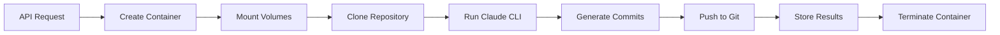

# Claude-Code Agent Architecture

## Overview

The Claude-Code agent is a new agent framework type that runs Claude CLI in isolated Docker containers while maintaining full integration with the Automagik Agents framework. It enables long-running, autonomous AI workflows with state persistence and git integration.

## Key Design Principles

1. **Container Isolation**: Each session runs in its own Docker container
2. **State Persistence**: Workspace volumes maintain state between interactions
3. **Git Integration**: All changes are committed and pushed automatically
4. **Async Execution**: API returns immediately, clients poll for results
4. **No Breaking Changes**: Uses existing database schema and infrastructure

## Architecture Components

### 1. Agent Framework Integration

```
src/agents/
├── pydanticai/        # Existing framework
├── langgraph/         # Existing framework  
└── claude-code/       # New framework type
    ├── agent.py       # ClaudeCodeAgent extends AutomagikAgent
    ├── container.py   # Docker container lifecycle management
    ├── executor.py    # Claude CLI execution logic
    └── workflows/     # Configurable agent behaviors
```

### 2. Container Lifecycle



### 3. Data Flow

1. **Request Phase**:
   - Client sends POST to `/api/v1/agent/claude-code/{workflow}/run`
   - API validates request and creates session
   - Returns run_id immediately (async pattern)

2. **Execution Phase**:
   - Background task creates and starts container
   - Claude runs with `--dangerously-skip-permissions`
   - Execution can take hours without intervention
   - Container blocks until Claude completes

3. **Completion Phase**:
   - Claude generates semantic commit messages
   - Changes pushed to git repository
   - Results stored in PostgreSQL
   - Container terminated

### 4. Database Integration

Uses existing tables with JSONB storage:

**Sessions Table**:
```json
{
  "metadata": {
    "agent_type": "claude-code",
    "workflow_name": "bug-fixer",
    "container_id": "abc123",
    "volume_name": "session-uuid-workspace",
    "git_branch": "fix/timeout"
  }
}
```

**Messages Table**:
```json
{
  "raw_payload": {
    "request": {...},
    "response": {
      "claude_session_id": "...",
      "exit_code": 0,
      "git_commits": ["sha1", "sha2"]
    }
  },
  "context": {
    "execution_time": 3600.5,
    "container_logs": "..."
  }
}
```

## Security Considerations

1. **Container Isolation**: Each session isolated from others
2. **Credential Management**: Read-only mounts, temporary access
3. **Resource Limits**: CPU/memory constraints enforced
4. **Network Policies**: Restricted container networking
5. **Audit Trail**: All actions logged and traceable

## Performance Characteristics

- **Container Startup**: 5-10 seconds
- **Concurrent Sessions**: 50+ supported
- **Memory Per Container**: 2GB limit
- **CPU Per Container**: 2 cores limit
- **Execution Timeout**: 2 hours default

## Failure Modes and Recovery

1. **Container Crash**: Detected via health checks, session marked failed
2. **Timeout**: Configurable per workflow, graceful shutdown
3. **Git Conflicts**: Automatic rebase attempted, manual intervention logged
4. **Resource Exhaustion**: Queue overflow returns 429 status
5. **Network Issues**: Exponential backoff with retry

## Integration Points

### With Existing Infrastructure
- Uses AutomagikAgent base class
- Leverages existing session/message repositories  
- Integrates with agent factory pattern
- Compatible with existing authentication

### With External Systems
- Git repositories for code persistence
- MCP servers for tool access
- Docker daemon for container management
- PostgreSQL for state storage

## Rollback Strategy

1. Set `AM_ENABLE_CLAUDE_CODE=false` 
2. Stop all running containers
3. Remove Docker volumes
4. Agent type becomes unavailable
5. No impact on other agents

## Success Metrics

- Container reliability > 99.9%
- Average startup time < 10s
- Git push success rate > 99%
- Zero credential leaks
- Support 50+ concurrent sessions

## Related Documentation

- [Implementation Plan](./IMPLEMENTATION_PLAN.md)
- [Container Patterns](../../../docs/patterns/container-execution.md)
- [Async API Design](../../../docs/patterns/async-api.md)