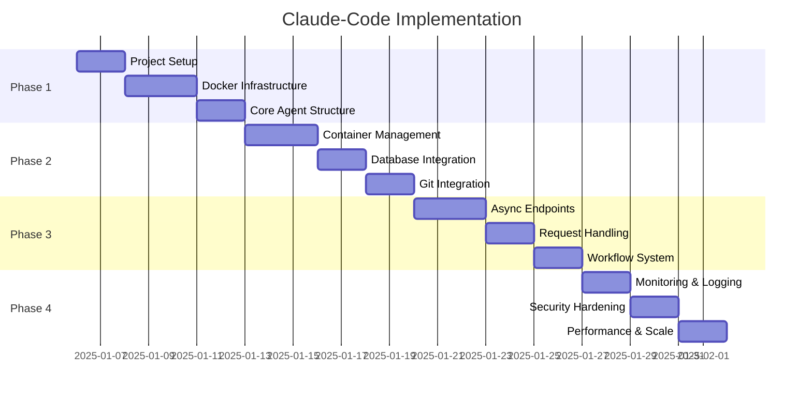

# Claude-Code Implementation Roadmap

## Phase 1: Foundation (Week 1)

### 1.1 Project Setup ✅
- [x] Create directory structure
- [x] Architecture documentation
- [x] Technical decisions
- [ ] Linear project creation
- [ ] Initial git commit

### 1.2 Docker Infrastructure
- [ ] Create Dockerfile
- [ ] Implement entrypoint.sh
- [ ] Docker-compose for development
- [ ] Container build testing
- [ ] Volume management

### 1.3 Core Agent Structure
- [ ] ClaudeCodeAgent class
- [ ] Agent factory registration
- [ ] Basic configuration
- [ ] Dependency injection
- [ ] Initial unit tests

**Deliverables**: 
- Working container that runs Claude
- Agent registered in factory
- Basic test suite

**Success Criteria**:
- Container starts in < 10 seconds
- Claude executes simple command
- Agent appears in API listing

---

## Phase 2: Integration (Week 2)

### 2.1 Container Management
- [ ] ContainerManager implementation
- [ ] Lifecycle methods
- [ ] Health checking
- [ ] Resource limits
- [ ] Error handling

### 2.2 Database Integration
- [ ] Session metadata storage
- [ ] Message result storage
- [ ] Repository integration
- [ ] JSONB query optimization
- [ ] Integration tests

### 2.3 Git Integration
- [ ] Repository cloning
- [ ] Credential management
- [ ] Commit generation
- [ ] Push functionality
- [ ] Conflict handling

**Deliverables**:
- Full container lifecycle
- Database persistence
- Git workflow working

**Success Criteria**:
- Sessions persist across restarts
- Git commits have semantic messages
- No credential leaks in logs

---

## Phase 3: API Layer (Week 3)

### 3.1 Async Endpoints
- [ ] Run endpoint implementation
- [ ] Status polling endpoint
- [ ] Background task processing
- [ ] Queue management
- [ ] Error responses

### 3.2 Request Handling
- [ ] Parameter validation
- [ ] Workflow selection
- [ ] Authentication integration
- [ ] Rate limiting
- [ ] OpenAPI documentation

### 3.3 Workflow System
- [ ] Bug-fixer workflow
- [ ] PR-reviewer workflow  
- [ ] Code-task workflow
- [ ] Configuration loading
- [ ] Tool permissions

**Deliverables**:
- Complete API implementation
- Three working workflows
- API documentation

**Success Criteria**:
- API handles concurrent requests
- Workflows execute correctly
- Documentation accurate

---

## Phase 4: Production Ready (Week 4)

### 4.1 Monitoring & Logging
- [ ] Container metrics
- [ ] Execution tracking
- [ ] Cost calculation
- [ ] Health endpoints
- [ ] Alert configuration

### 4.2 Security Hardening
- [ ] Credential rotation
- [ ] Network policies
- [ ] Audit logging
- [ ] Vulnerability scanning
- [ ] Security documentation

### 4.3 Performance & Scale
- [ ] Load testing
- [ ] Resource optimization
- [ ] Concurrent session limits
- [ ] Caching strategies
- [ ] Performance benchmarks

**Deliverables**:
- Production-ready system
- Monitoring dashboards
- Security assessment

**Success Criteria**:
- 50+ concurrent sessions
- 99.9% uptime
- Zero security issues

---

## Testing Strategy

### Unit Tests
- Agent class methods
- Container manager
- Executor logic
- Model validation

### Integration Tests
- Docker operations
- Database persistence
- Git workflows
- API endpoints

### End-to-End Tests
- Complete bug fix workflow
- PR review workflow
- Multi-turn conversations
- Error recovery

### Performance Tests
- Container startup time
- Concurrent execution
- Resource usage
- API response times

---

## Risk Mitigation

### Technical Risks
| Risk | Impact | Mitigation |
|------|--------|------------|
| Container startup slow | High | Pre-built images, caching |
| Git conflicts | Medium | Automatic rebase, alerts |
| Resource exhaustion | High | Limits, monitoring, queues |
| Credential exposure | Critical | Secure mounts, rotation |

### Operational Risks
| Risk | Impact | Mitigation |
|------|--------|------------|
| Docker daemon failure | High | Health checks, redundancy |
| Database overload | Medium | Connection pooling, indexes |
| Network issues | Medium | Retries, circuit breakers |
| Cost overruns | Low | Usage tracking, limits |

---

## Success Metrics

### Phase 1
- Container builds: 100% success
- Startup time: < 10 seconds
- Basic operations: Working

### Phase 2
- Data persistence: 100% reliable
- Git operations: 95% success
- Integration tests: All passing

### Phase 3
- API availability: 99.9%
- Concurrent requests: 10+
- Documentation: Complete

### Phase 4
- Production ready: Yes
- Security audit: Passed
- Performance: Meeting SLAs

---

## Dependencies

### External
- Docker daemon
- PostgreSQL database
- Git repositories
- MCP servers

### Internal
- AutomagikAgent framework
- Session/Message repositories
- Authentication system
- Agent factory

---

## Timeline

---

## Next Steps

1. Get human approval for architecture
2. Create Linear project and tasks
3. Begin Phase 1 implementation
4. Set up development environment
5. Start Docker infrastructure work